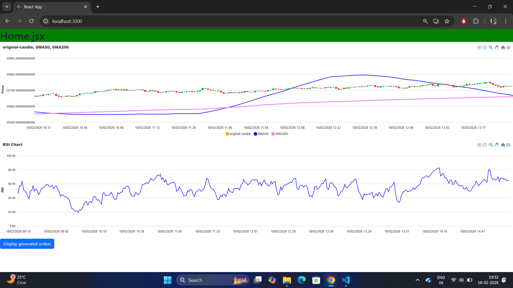
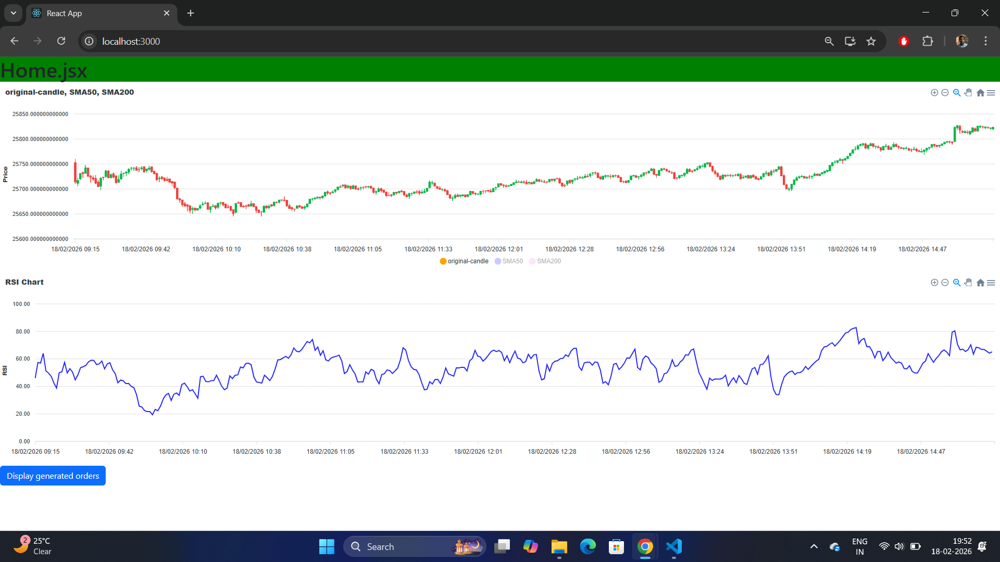
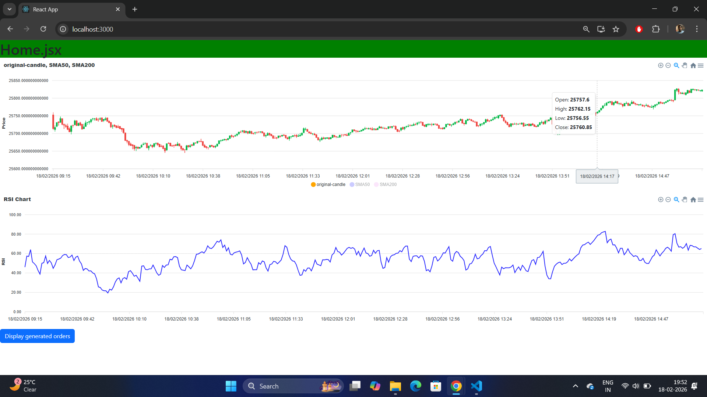
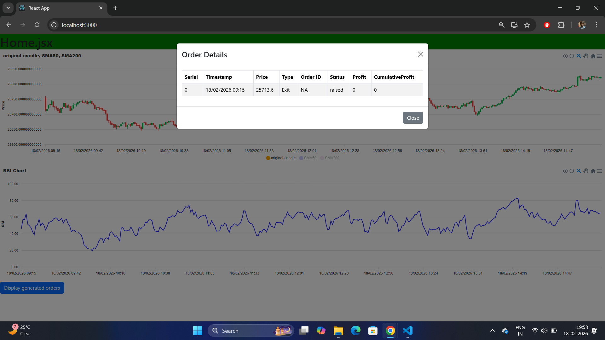

# Trading-Automation-Frontend
Inside this repositories a react.js application it will display candelstick chart, sma50, sma200 and RSI indicator. It also opens a display modal of auto generated order list.

# Install Dependencies
use npm install to install all dependencies.

# Startup
To start the server just run npm start. The application will run on 3000 port as default.

# Backend Integration
Update Home.jsx file's socket connection to where the backend socket is running.
# Demo images
 
Candelstick patterns with sma50, sma200 and RSI indicator

 
you can disable other indicator displaying in screen

 
Details of the candle when you hover on the chart

Generated orders